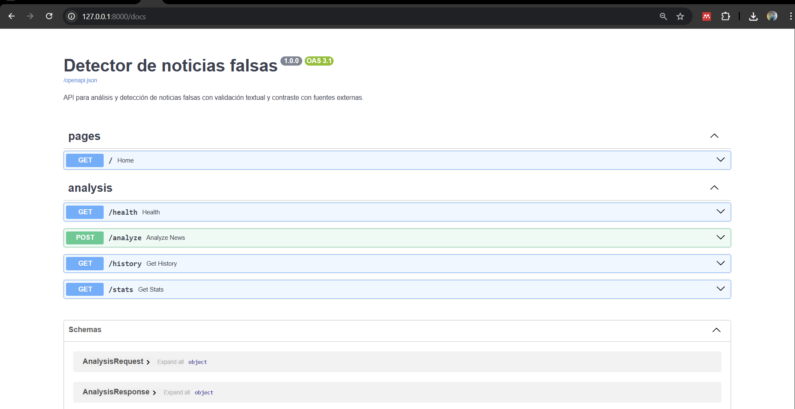

<div align="center">

# 🛡️ Detector de noticias falsas
**Trabajo Académico — Grupo 3**

*Integrantes: Erik Flores • Cristian González • Klever Barahona*

</div>

---

> **📌 Descripción del proyecto**  
> API REST desarrollada en FastAPI para analizar contenido noticioso y detectar señales de desinformación mediante evidencia externa y reglas heurísticas explicables.

### 🎯 Enfoque de la solución
- **Integración externa**: Google Fact Check Tools API para recuperar verificaciones publicadas.
- **Procesamiento de datos**: análisis de título, contenido, enlace, fuente y autor.
- **Motor heurístico**: cálculo de `risk_score`, `credibility_score` y veredicto final.
- **Interfaz amigable**: vista web en tiempo real para análisis, historial y estadísticas.

---

## 🧩 Repositorio del proyecto

Este repositorio incluye:
- Código fuente del API.
- Configuración del modelo heurístico (`config/rules.yaml`).
- `README.md` documentado.

<details>
<summary><strong>Ver estructura base</strong></summary>

```text
app/
  main.py
  database.py
  models/
  routers/
  schemas/
  services/
  templates/
  static/
config/
docs/screenshots/
requirements.txt
README.md
```

</details>

---

## 🚀 Ejecución local

<details open>
<summary><b>1. Preparación del entorno</b></summary>
<br>

```powershell
python -m venv .venv
.\.venv\Scripts\Activate.ps1
pip install -r requirements.txt
$env:FACT_CHECK_API_KEY="tu_api_key_aqui"
```

</details>

<details open>
<summary><b>2. Iniciar servidor</b></summary>
<br>

```powershell
uvicorn app.main:app --reload
```

</details>

Accesos:
- Interfaz: [http://127.0.0.1:8000](http://127.0.0.1:8000)
- Swagger: [http://127.0.0.1:8000/docs](http://127.0.0.1:8000/docs)

---

## 🔌 Endpoints disponibles

<details>
<summary><b>1. 🟢 Estado del servicio (<code>GET /health</code>)</b></summary>
<br>

```bash
curl -X GET "http://127.0.0.1:8000/health"
```

</details>

<details>
<summary><b>2. 🧠 Análisis principal (<code>POST /analyze</code>)</b></summary>
<br>

```bash
curl -X POST "http://127.0.0.1:8000/analyze" \
  -H "Content-Type: application/json" \
  -d "{\"title\":\"El 5G causa covid\",\"content\":\"...\"}"
```

</details>

<details>
<summary><b>3. 🗂️ Historial (<code>GET /history</code>)</b></summary>
<br>

```bash
curl -X GET "http://127.0.0.1:8000/history"
```

</details>

<details>
<summary><b>4. 📊 Estadísticas (<code>GET /stats</code>)</b></summary>
<br>

```bash
curl -X GET "http://127.0.0.1:8000/stats"
```

</details>

---

<div align="center">

## 📸 Evidencia del proyecto (local)

</div>

### 1️⃣ Interfaz principal cargada localmente


### 2️⃣ Caso de noticia falsa detectada


### 3️⃣ Caso de noticia real o con alta corroboración


### 4️⃣ Swagger `/docs` funcionando



📌 Pregunta 1

¿Cómo podría un atacante manipular el contenido de entrada (título, texto, fuente o enlace) para evadir la detección o forzar un veredicto incorrecto, y qué implicaciones tendría esto en la confiabilidad del sistema?

Un atacante podría manipular los datos de entrada mediante técnicas de evasión conocidas como adversarial inputs. Por ejemplo, puede alterar ligeramente palabras clave, usar sinónimos, introducir errores ortográficos intencionales, o insertar caracteres especiales y ruido dentro del texto para evitar que los algoritmos detecten patrones asociados a desinformación.

Asimismo, podría falsificar la fuente o utilizar enlaces que aparenten ser confiables (por ejemplo, dominios similares a medios legítimos), lo que puede engañar a los mecanismos heurísticos basados en reputación.

Estas manipulaciones pueden provocar falsos negativos (contenido falso clasificado como verdadero) o falsos positivos, afectando directamente la confiabilidad del sistema. Como consecuencia, el sistema podría perder credibilidad, ser explotado para difundir desinformación o ser utilizado como herramienta de manipulación si no cuenta con mecanismos robustos de validación, normalización de texto y modelos resistentes a ataques adversariales.
