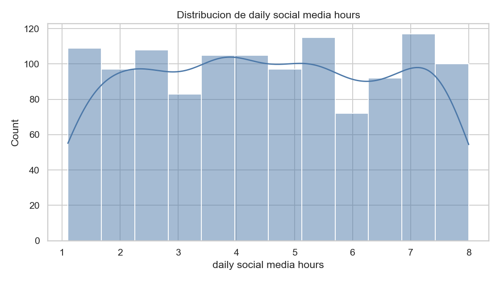
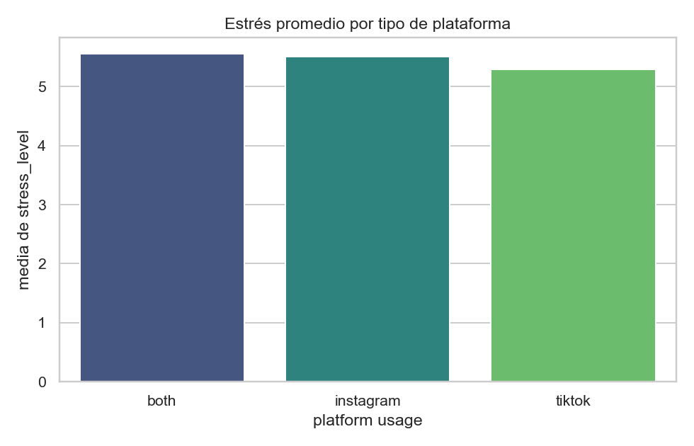
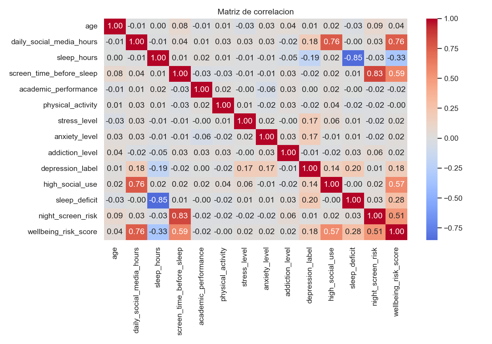

<div align="center">

# Impacto del uso de redes sociales en el estrés adolescente
**Trabajo Académico — Grupo 3**

*Integrantes: Erik Flores • Cristian González • Klever Barahona*

</div>

---

> **📌 Descripción del proyecto**  
> El presente trabajo analiza el dataset de Kaggle **Social Media Impact on Teen Mental Health** con el fin de evaluar la relación entre hábitos digitales, estilo de vida y nivel de estrés en población adolescente. La propuesta integra limpieza de datos, análisis exploratorio y modelado predictivo bajo un enfoque metodológico reproducible.

### 🎯 Enfoque de la solución
- **Definición del problema**: estimar `stress_level` a partir de variables de conducta digital y hábitos cotidianos.
- **Preparación del dataset**: depuración, normalización y transformación de variables para asegurar consistencia analítica.
- **Análisis exploratorio (EDA)**: identificación de patrones descriptivos, relaciones bivariadas e interacciones relevantes.
- **Evaluación predictiva**: comparación de Logistic Regression y Random Forest con métricas de clasificación y validación cruzada.

---

## Descripción del propósito del dataset

El dataset **Social Media Impact on Teen Mental Health** fue diseñado para estudiar el efecto del uso de redes sociales sobre la salud mental adolescente. Contiene variables de comportamiento diario (horas en redes, plataforma usada, sueño, pantalla antes de dormir, actividad física, interacción social y rendimiento académico) junto con indicadores de salud mental (`stress_level`, `anxiety_level`, `addiction_level` y `depression_label`).

**Enlace oficial del dataset:**  
https://www.kaggle.com/datasets/algozee/teenager-menthal-healy

Utilidad del dataset en este trabajo:
- describir patrones de conducta digital y bienestar en adolescentes;
- analizar asociaciones entre hábitos cotidianos y niveles de estrés, ansiedad y depresión;
- construir modelos de clasificación para estimar riesgo de afectación en salud mental;
- aportar evidencia para análisis académico y para enfoques de detección temprana basados en datos.

---

## 🧩 Repositorio del proyecto

Este repositorio concentra el desarrollo del trabajo:
- datos en estado original y procesado,
- notebooks ejecutables por fase metodológica (`01`, `02`, `03`),
- módulos Python reutilizables en `src/`,
- documentación técnica para evaluación académica.

<details>
<summary><strong>Ver estructura base</strong></summary>

```text
data/
  raw/
    Teen_Mental_Health_Dataset.csv
  processed/
    cleaned_data.csv
    model_ready.csv
images/
notebooks/
  01_data_cleaning.ipynb
  02_eda.ipynb
  03_modeling.ipynb
src/
  data_cleaning.py
  eda.py
  modeling.py
  utils.py
requirements.txt
README.md
```

</details>

---

## 🚀 Ejecución local

<details open>
<summary><b>1. Preparación del entorno</b></summary>
<br>

```powershell
python -m venv .venv
.\.venv\Scripts\Activate.ps1
pip install -r requirements.txt
```

</details>

<details open>
<summary><b>2. Flujo de ejecución</b></summary>
<br>

```powershell
# Ejecutar en orden en Jupyter:
01_data_cleaning.ipynb
02_eda.ipynb
03_modeling.ipynb
```

</details>

---

## 🧼 Procesamiento de datos (limpieza y transformación)

La etapa de preparación se implementa en `src/data_cleaning.py` y se documenta en `notebooks/01_data_cleaning.ipynb`.

<details>
<summary><b>Ver pasos de limpieza y transformación</b></summary>
<br>

- Estandarización de nombres de columnas.
- Eliminación de duplicados.
- Imputación de valores faltantes:
  - mediana en variables numéricas,
  - moda en variables categóricas.
- Normalización de categorías de texto (`gender`, `platform_usage`, `social_interaction_level`).
- Ajuste de rangos plausibles para variables de edad y horas.
- Tratamiento de valores extremos por winsorización (percentiles 1 y 99).
- Creación de variables derivadas:
  - `social_use_bin`, `high_social_use`,
  - `sleep_bin`, `sleep_deficit`,
  - `night_screen_risk`,
  - `wellbeing_risk_score`.
- Generación de dos datasets finales:
  - `cleaned_data.csv` (base para análisis descriptivo),
  - `model_ready.csv` (base para evaluación predictiva).

</details>

---

## 📊 Análisis exploratorio de datos (EDA)

El EDA se desarrolla en `notebooks/02_eda.ipynb` mediante `src/eda.py`, con foco en responder los objetivos de análisis del trabajo.

<details>
<summary><b>Ver visualizaciones desarrolladas</b></summary>
<br>

- distribuciones de variables numéricas relevantes,
- relación de `stress_level` con:
  - `daily_social_media_hours`,
  - `sleep_hours`,
  - `screen_time_before_sleep`,
  - `physical_activity`,
- promedio de estrés por plataforma,
- interacción `sleep_bin` vs `social_use_bin`,
- matriz de correlación.

</details>

### Principales hallazgos del análisis
<details>
<summary><b>Ver hallazgos principales del análisis</b></summary>
<br>

- Las correlaciones bivariadas con `stress_level` resultan bajas, lo que descarta la existencia de un único predictor lineal dominante.
- El análisis conjunto de sueño, uso de redes y exposición nocturna a pantallas muestra variaciones más informativas que el análisis aislado de cada variable.
- La evidencia descriptiva sugiere un fenómeno multivariable; por ello, el EDA se complementa con modelado supervisado.

</details>

---

## 🤖 Modelado e insights relevantes

El modelado se desarrolla en `notebooks/03_modeling.ipynb` mediante `src/modeling.py`, comparando desempeño y estabilidad entre algoritmos.

<details>
<summary><b>Ver modelos y métricas de evaluación</b></summary>
<br>

Modelos evaluados:
- Logistic Regression
- Random Forest

Métricas reportadas para evaluación:
- `accuracy`
- `precision`
- `recall`
- `f1`
- validación cruzada estratificada (5 folds)
- matrices de confusión
- importancia de variables

</details>

Insights y conclusiones relevantes:
<details>
<summary><b>Ver insights y conclusiones relevantes</b></summary>
<br>

- El rendimiento obtenido es moderado y metodológicamente consistente con una tarea de clasificación multiclase sobre datos observacionales.
- Entre las variables con mayor aporte predictivo destacan rendimiento académico, `wellbeing_risk_score`, horas de uso de redes y horas de sueño.
- Los resultados respaldan una lectura asociativa y predictiva del problema; no se infiere causalidad directa entre variables.

</details>

---

<div align="center">

## 📸 Evidencia del proyecto (local)

</div>

### 1️⃣ Ejecución de limpieza y transformación


### 2️⃣ Análisis por plataforma de uso


### 3️⃣ Matriz de correlación del dataset procesado


### 4️⃣ Modelado y evaluación por matrices de confusión
*(Resultados visibles en `notebooks/03_modeling.ipynb`)*

---

## 💬 Observación de calificación — interpretabilidad del Random Forest

> **Pregunta**  
> Su Random Forest les ayudaría a predecir si un adolescente va a presentar estrés? ¿Qué pueden hacer si quieren explicar por qué?

**Respuesta**

El Random Forest del proyecto estima `stress_level` a partir de hábitos y variables del dataset (`src/modeling.py`, `notebooks/03_modeling.ipynb`, `data/processed/model_ready.csv`). Para explicar por qué predice así: a nivel global ya se usa la importancia de variables del bosque sobre las features del preprocesamiento, con comparación frente a fuga de información en las entradas. A nivel local (un adolescente concreto) lo habitual es complementar con SHAP y, si aplica, PDP/ICE o importancia por permutación. Eso explica el criterio del modelo en datos observacionales; no implica causalidad ni diagnóstico clínico.
